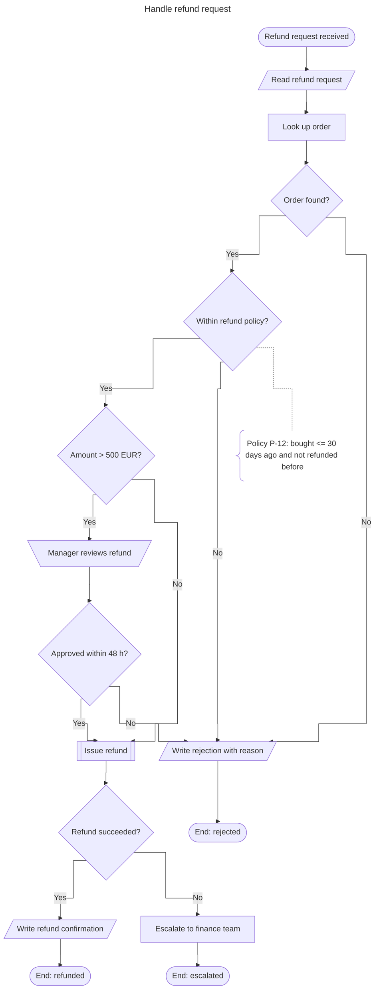

# ANSI/ISO 5807:1985 Flowcharting: Rules, Syntax and Skill Analysis

A strict practitioner's guide to the flowchart standard **ISO 5807:1985** (*Information
processing: Documentation symbols and conventions for data, program and system flowcharts,
program network charts and system resources charts*), adopted in the United States as
**ANSI/ISO 5807-1985**, which replaced ANSI X3.5-1970. ISO confirmed the 1985 edition at
its 2019 systematic review, so it is still the current edition.

This guide has three parts:

1. **[Rules and syntax](#part-1-rules-and-syntax)**: symbols, flowlines, connectors, text,
   structure and layout, each rule with an ID.
2. **[Analysis of the flowcharting skill](#part-2-analysis-of-the-flowcharting-skill)**:
   abstraction, algorithmic and systemic thinking, granularity control, translation and
   communication.
3. **[Tooling](#part-3-tooling)**: how the MCP server in this repository turns the rules into
   checks.

> **Reading the rules.** The standard's text is copyrighted, so every rule here is a
> paraphrase. Each rule carries a **basis** tag:
>
> | Tag | Meaning |
> |---|---|
> | **[ISO]** | Paraphrase of a provision of ISO 5807:1985. Conformance requirement. |
> | **[Practice]** | Widely adopted professional practice (structured design, testing, readability) that goes beyond the letter of the standard. The validator still enforces it, because a chart that breaks it is ambiguous or wrong in practice. |
> | **[Legacy]** | ANSI X3.5-1970 convention that ISO 5807 does not define. Allowed only in lenient mode. |
>
> Rule IDs (`SYM-04`, `CON-02`, …) are this guide's own identifiers, not ISO clause numbers.
> The same IDs appear in the MCP server's findings, so a tool message always points back to
> a section here.

---

## Contents

- [Part 1: Rules and syntax](#part-1-rules-and-syntax)
  - [1.1 The five chart types](#11-the-five-chart-types)
  - [1.2 Principles of the symbol system](#12-principles-of-the-symbol-system)
  - [1.3 Core symbols: geometry and strict use](#13-core-symbols-geometry-and-strict-use)
  - [1.4 Flowlines and flow logic](#14-flowlines-and-flow-logic)
  - [1.5 Connectors](#15-connectors)
  - [1.6 Text and annotation](#16-text-and-annotation)
  - [1.7 Structural integrity](#17-structural-integrity)
  - [1.8 Layout and density](#18-layout-and-density)
  - [1.9 Conformance checklist](#19-conformance-checklist)
- [Part 2: Analysis of the flowcharting skill](#part-2-analysis-of-the-flowcharting-skill)
  - [2.1 Cognitive abstraction](#21-cognitive-abstraction)
  - [2.2 Algorithmic and systemic thinking](#22-algorithmic-and-systemic-thinking)
  - [2.3 Granularity control](#23-granularity-control)
  - [2.4 Translation and communication](#24-translation-and-communication)
  - [2.5 Developing the skill](#25-developing-the-skill)
- [Part 3: Tooling](#part-3-tooling)
- [References](#references)

---

# Part 1: Rules and syntax

## 1.1 The five chart types

ISO 5807 is not only about program flowcharts. It defines five kinds of chart, and the chart
type decides which symbols make sense. Name the chart type before you draw the first symbol.

| Chart type (`chart_type`) | Question it answers | Built from |
|---|---|---|
| **Program flowchart** (`program`) | In what order does the program execute its operations? | Process symbols (operations, and the logic that picks the path), flowlines (control flow), special symbols. Input/output steps conventionally use the basic **Data** symbol. |
| **Data flowchart** (`data`) | Which data passes through which processing phases, and on which media? | Data symbols (possibly medium-specific), process symbols, flowlines (data flow), special symbols. Every processing symbol has data on its input and output sides, and the chart begins and ends with data (or special) symbols. |
| **System flowchart** (`system`) | How are operations controlled, and how does data flow through the whole system, people included? | Data symbols, process symbols (including manual operations), flowlines for data and control flow, special symbols. |
| **Program network chart** (`program_network`) | Which programs activate which, and what data do they share? | One process symbol per program (each program appears **once**), data symbols, activation and data lines. |
| **System resources chart** (`system_resources`) | Which data units and processing units make up the configuration? | Data symbols for devices, process symbols for processors, lines for data and control transfer. |

**SYM-06 [ISO]: use symbols that belong to the chart type.** A program flowchart describes
control flow inside a program, so a *Punched card* or *Manual operation* symbol in it mixes
two charts' questions. Use the basic Data symbol for I/O, or make it a system flowchart. In
program network and system resources charts there is no decision logic at all, so Decisions
and Loop limits do not belong there.

## 1.2 Principles of the symbol system

The standard groups its symbols into four families:

| Family | Basic symbol(s) | Specific symbols |
|---|---|---|
| **Data** | Data, Stored data | Internal storage, Sequential access storage, Direct access storage, Document, Manual input, Card, Punched tape, Display |
| **Process** | Process | Predefined process, Manual operation, Preparation, Decision, Parallel mode, Loop limit |
| **Line** | Line (flowline) | Control transfer, Communication link, Dashed line |
| **Special** | n/a | Connector, Terminator, Annotation, Ellipsis |

Three principles govern all of them:

- **SYM-01 [ISO]: closed vocabulary.** Use only the standard's symbols, each with its defined
  meaning. Inventing shapes ("a star for urgent steps") or reusing a shape with another meaning
  ("a circle for start") breaks the shared language that makes a standard useful.
- **SYM-02 [ISO]: basic by default, specific by intent.** A basic symbol is always correct.
  A specific symbol adds information ("this is a document", "a person does this") and is
  used only when that information is known **and** relevant to the chart's purpose. A data
  flowchart about media uses Document and Direct access storage; a program flowchart uses
  Data.
- **SYM-03 [ISO]: shape carries meaning; size, colour and shading do not.** Symbols may be
  drawn at any size, but the outline must stay recognisable and proportions consistent within
  a chart. Do not rotate or mirror symbols (the loop limit's two defined parts are the
  exception). The standard gives colour, shading and line weight no meaning. You may use
  colour as redundant emphasis, never as the only carrier of information.

## 1.3 Core symbols: geometry and strict use

The tables give the exact outline, the meaning in the standard, and the boundaries of
correct use. The last column names the Mermaid shape the generator uses
(see [Part 3](#part-3-tooling)).

### Process symbols

| Symbol (`type`) | Geometry | Meaning | Use strictly for | Never use for | Mermaid |
|---|---|---|---|---|---|
| **Process** (`process`) | Rectangle, normally wider than high. | Any processing function: an operation that changes the value, form or location of information. | One well-defined action when no specific process symbol applies. | A question (that is a Decision); several unrelated actions. | `rect` |
| **Predefined process** (`predefined_process`) | Rectangle with an extra vertical line just inside each of the left and right sides. | A named process (subroutine, module, library function) whose steps are specified elsewhere. | Calls to reusable or external routines; collapsing a sub-flow to keep one level of abstraction. | A step that is not specified anywhere. | `fr-rect` |
| **Manual operation** (`manual_operation`) | Trapezoid with the **longer** parallel side at the **top**. | Any process performed by a human being. | Steps a person performs without automatic support (inspect, sign, approve on paper). | Keyboard entry at processing time (that is Manual input); program flowcharts. | `trap-t` |
| **Preparation** (`preparation`) | Horizontally elongated hexagon. | Modifying an instruction or group of instructions to affect later activity: setting a switch, modifying an index register, initializing a routine. | Initializing counters, accumulators, switches and loop variables. | Ordinary processing; decisions. | `hex` |
| **Decision** (`decision`) | Rhombus (diamond) with vertices at top, bottom, left and right. | A decision or switching function with **one entry** and **several alternative exits**, exactly one of which is taken after the condition inside is evaluated. | Every test whose outcome selects a path. | A command; a merge point (merges are line junctions; see FLW-04). | `diam` |
| **Parallel mode** (`parallel_mode`) | Two parallel horizontal lines (a double bar) across the flowlines. | Synchronization of two or more parallel operations. Paths below the bar start together; a path below a join starts only when **all** paths entering it are complete. | Fork and join of concurrent work. | Alternatives (those need a Decision). | `fork` |
| **Loop limit** (`loop_limit`) | Two parts. **Beginning**: rectangle with both **upper** corners cut off. **End**: rectangle with both **lower** corners cut off. | Beginning and end of a loop. Both parts carry the **same loop identifier**; initialization, increment and termination condition go into the part where the test is made. | Structured loops in program flowcharts. | Half a loop; an extra back-edge (the pair already implies repetition). | `notch-pent` |

### Data symbols

| Symbol (`type`) | Geometry | Medium / meaning | Mermaid |
|---|---|---|---|
| **Data** (`data`) | Parallelogram, horizontal top and bottom, leaning right. | Data, medium unspecified. The usual I/O symbol in program flowcharts. | `lean-r` |
| **Stored data** (`stored_data`) | Rectangle whose left and right sides are arcs curving the same way (convex left, concave right). | Data stored in a form suitable for processing, medium unspecified. | `bow-rect` |
| **Internal storage** (`internal_storage`) | Square or rectangle with one extra line parallel to the top edge and one parallel to the left edge, close to them. | Data in internal (main) storage. | `win-pane` |
| **Sequential access storage** (`sequential_access_storage`) | Circle with a tangent line from its lowest point running horizontally to the right (a tape reel). | Magnetic tape, cartridge, cassette: sequential media. | `dbl-circ` (approximation) |
| **Direct access storage** (`direct_access_storage`) | Cylinder lying on its side, one end drawn as a full ellipse. | Magnetic disk, drum, flexible disk; today also databases on disk. | `h-cyl` |
| **Document** (`document`) | Rectangle with a wavy bottom edge. | Human-readable data: printout, form, OCR/MICR document, microfilm, tally roll. | `doc` |
| **Manual input** (`manual_input`) | Rectangle whose top edge slopes upward from left to right. | Data entered manually at processing time: keyboard, switches, push buttons, light pen, bar-code wand. | `sl-rect` |
| **Card** (`card`) | Rectangle with the upper-left corner cut off. | Card media: punched, magnetic, mark-sense cards. | `notch-rect` |
| **Punched tape** (`punched_tape`) | Rectangle with wavy top and bottom edges. | Punched (paper) tape. | `flag` |
| **Display** (`display`) | Pointed, curved left end; straight top and bottom; rounded right end (a CRT silhouette). | Data displayed for human use: screens, indicators. | `curv-trap` |

**Choosing a data symbol** (SYM-02): if the medium does not matter, use **Data** (for I/O
steps) or **Stored data** (for a store). If it matters: printed or paper → Document; on a
screen → Display; typed or scanned at processing time → Manual input; database/disk →
Direct access storage; tape → Sequential access storage; main memory → Internal storage.
Card and Punched tape are for documenting those media; they are rare today.

### Line symbols

| Symbol | Geometry | Meaning | Model |
|---|---|---|---|
| **Line (flowline)** | Solid straight line, horizontal or vertical; arrowhead at the destination end when required (FLW-02). | Flow of data or control. | edge `kind: flow` |
| **Control transfer** | A line with the standard's control-transfer marking, distinct from an ordinary flowline. | Immediate transfer of control from one process to another, possibly with a direct return when the called process finishes. | edge `kind: control_transfer` |
| **Communication link** | Zigzag (lightning-bolt) line; arrowheads give the direction. | Data transfer over a telecommunication link. | edge `kind: communication_link` |
| **Dashed line** | Dashed line. | Alternative relationship between symbols; also encloses an annotated area and attaches an Annotation. | edge `kind: dashed` |

**FLW-08 [ISO]**: each line variant keeps its meaning. Program flowcharts use ordinary
flowlines. Communication links and control transfers belong to system, data, network and
resources charts.

### Special symbols

| Symbol (`type`) | Geometry | Meaning | Mermaid |
|---|---|---|---|
| **Terminator** (`terminator`) | Stadium: horizontal rectangle whose short sides are semicircles. | Exit to, or entry from, the outside environment: start or end of a program flow, origin or destination of data. Also the first and last symbol of a detailed representation. | `stadium` |
| **Connector** (`connector`) | Small circle. | Exit to, or entry from, another part of the **same** chart; breaks a line and continues it elsewhere. Matching connectors share one identifier. | `circle` |
| **Annotation** (`annotation`) | Open rectangle (a bracket) joined by a dashed line to what it explains. | Descriptive comments or explanatory notes. | `brace` |
| **Ellipsis** (`ellipsis`) | Three dots ( … ). | Omission of symbols whose type and number are not specified. | `text` |

**Legacy [ANSI X3.5]: the off-page connector** (`off_page_connector`) is a pentagon shaped
like a baseball home plate. It is on many templates and in ANSI X3.5-1970, but ISO 5807 does
not define it. Strict mode reports it under **CON-04**; see [1.5](#15-connectors).

### Symbol-specific conventions

**SYM-08 [ISO]: a Terminator is either a start or an end.** A start Terminator has no
incoming line and exactly one outgoing line. An end Terminator has incoming line(s) only.
Text: `Start`, `End`, `Return`, the routine name, or (for several ends) the outcome:
`End: refunded`, `End: rejected`.

**SYM-04 [ISO]: striped symbols.** A horizontal stripe drawn near the top of a process or
data symbol says that a **more detailed representation exists elsewhere in the same
documentation set**. The identifier of that representation is written between the stripe and
the top edge:

```text
+------------------------+
|          A12           |  <- identifier of the detailed chart
|------------------------|  <- the stripe
|     Validate order     |  <- normal symbol text
+------------------------+
```

The detailed chart **A12** begins and ends with Terminators. In the model, set
`"detail_ref": "A12"`.

**SYM-05 [ISO]: Predefined process vs striped symbol.** Both say "the detail is elsewhere".
The Predefined process means *specified elsewhere* (a library routine, another system's
module). The stripe means *detailed in this documentation set*. Do not stripe a Predefined
process, because the double side lines already say it.

**SYM-09 [ISO]: Decision exits.** A Decision has one entry and two or more exits. ISO
shows two equivalent ways to draw several exits, and each exit's outcome is written beside
its line (TXT-03):

```text
 Method 1: a line per outcome         Method 2: one line that splits
               |                                   |
              / \                                 / \
     <0 -----<   >----- >0                       <   >
              \ /                                 \ /
               |                                   |
              =0                    <0 ------------+------------ >0
                                                   |
                                                  =0
```

**SYM-10 [ISO]: Parallel mode** needs at least two entries (join) or two exits (fork).
With one of each, it synchronizes nothing.

**SYM-11 [ISO]: Loop limit pairs.** Both parts carry the same identifier. Put the condition
where the test happens:

```text
     ___________________             test-before ("while"):   condition in the beginning part
    /  L1               \            test-after  ("until"):   condition in the end part
    | for each order    |
    +-------------------+
             |
        (loop body)
             |
    +-------------------+
    |  L1               |
    \ until no orders   /
     \_________________/
```

In the model: two `loop_limit` nodes with the same `loop_id`, roles `begin` and `end`. The
end part must be reachable from the beginning part.

**SYM-07 [ISO]: multiple symbols.** Overlapping copies of a data symbol (a stack of
Documents) show several media or files of the same kind (`"multiple": true`). The convention
is not used for process symbols; use Parallel mode for concurrent work.

**SYM-12 [ISO]: Ellipsis** shows omitted symbols ("file 1 … file n"). In a program
flowchart it must never hide decision logic or error handling, because omitted logic cannot
be reviewed.

## 1.4 Flowlines and flow logic

**FLW-01 [ISO]: normal direction.** The main flow runs **top to bottom** and **left to
right**. Choose `TB` for most program flowcharts; `LR` suits wide pipelines and system
flowcharts. Never lay out a chart bottom-to-top or right-to-left.

**FLW-02 [ISO]: arrowheads.** An arrowhead is **mandatory** on any line whose direction is
not the normal direction: an upward or right-to-left segment such as a loop back-edge. On
normal-direction lines arrowheads are optional, and the standard allows them anywhere for
clarity. Practice: in program flowcharts, put an arrowhead on every line. The Mermaid
generator always does.

**FLW-03 [ISO]: crossings carry no meaning.** Two lines that cross are unrelated and do not
join. Keep crossings to a minimum by moving symbols, or break one line with a connector
pair.

**FLW-04 [ISO]: junctions.** Two or more incoming lines may join into one outgoing line.
Draw each join as a T and show the merged direction with an arrowhead. Never make a
four-way join, because it looks like a crossing:

```text
  Junction (B joins A's line)          Crossing (no relationship)
        A        B                               |
        |        |                               |
        +---<----+                        -------+-------
        |                                        |
        v                                        |
        C
```

A merge is a junction, not a symbol. UML's merge diamond has no ISO meaning: a diamond with
one exit violates SYM-09.

**FLW-05 [Practice]: orthogonal routing.** Draw lines as horizontal and vertical segments.
Enter a symbol at the top (or left) and leave at the bottom (or right). Decision exits leave
from the vertices. Keep the main path straight and let alternatives branch to one side and
rejoin below. Pick one convention for outcome placement (for example "Yes" continues down,
"No" branches right) and use it in every chart of the documentation set.

**FLW-06 [Practice]: only Decisions (and Parallel mode) branch.** In a program flowchart
every other symbol has exactly one outgoing line. End Terminators and out-connectors have
none. Two exits from a Process leave the reader guessing: either-or or both? An outcome
label such as "Yes" on a line that leaves a Process is the tell-tale sign of a missing
Decision.

**FLW-07 [Practice]: no self-loops.** A line from a symbol back to itself is an
unconditional infinite loop. Route repetition through a Decision or a loop limit pair.

**FLW-09 [Practice]: no duplicate lines.** Two identical lines between the same symbols
suggest a distinction that does not exist.

**Loops and back-edges.** A back-edge leaves the Decision that ends the iteration, runs up
the side of the loop body (with an arrowhead, FLW-02), and joins the main line **above**
the first symbol of the body as a junction. Do not run it into the side of a symbol in the
middle of the body; that creates a second entry and a hidden GOTO.

## 1.5 Connectors

A connector replaces part of a flowline. It breaks the line where it would be long, would
cross others, or would leave the page, and continues it elsewhere.

**CON-01 [ISO]: a connector is an exit or an entry, never both.**

| Role | Incoming lines | Outgoing lines |
|---|---|---|
| **Out-connector** (exit) | one or more (several may join first) | none |
| **In-connector** (entry) | none | exactly one |

**CON-02 [ISO]: matching identifiers.** Every out-connector has exactly **one**
in-connector with the same identifier. Several out-connectors may lead to the same
in-connector (many-to-one is allowed), but one identifier must never mark two in-connectors,
because the reader could not tell where to continue.

```text
  Page 1                                 Page 2
  +--------------+                         .--.
  | Rate order   |              (3A) -->  ( 3A )   <- in-connector: no incoming line
  +--------------+                         '--'
         |                                   |
         v                                   v
       .--.                           +---------------+
      ( 3A )  <- out-connector        | Ship order    |
       '--'                           +---------------+
```

**CON-03 [Practice]: short, systematic identifiers.** On the same page use a single letter or
digit (`A`, `B`, `1`). For continuation on another page use a page-qualified identifier
(`3A`: page 3, connector A) and add the cross-reference ("to page 3") next to it if your
documentation needs it.

**CON-04 [ISO]: one connector symbol.** ISO 5807 has **one** connector: the small circle,
for continuation on the same page or another page. The pentagon off-page connector is an
ANSI X3.5-1970 legacy symbol. Strict ISO practice: circle plus page-qualified identifier,
modelled as `{"type": "connector", "off_page": true}`. If a documentation set has adopted the
pentagon, use it consistently and validate in lenient mode. Never mix the two conventions
for the same identifier.

**CON-05 [Practice]: connectors must not hide structure.**

- Use a connector only when a line would be long, crossed or cut by a page break. A short
  direct line is always clearer.
- Never jump into the middle of a loop or of a decision's branch. Connectors are the
  flowchart's GOTO; restructure instead.
- Place the out-connector at the end of a line segment and the in-connector at the start of
  one. A connector never sits between two symbols on the same line.
- "Connector spaghetti" (more than about one connector pair per eight symbols on one page) is
  a layout smell. Decompose the chart (LAY-01) instead.

## 1.6 Text and annotation

**TXT-01 [ISO]: minimum text.** A symbol holds only the text needed to understand its
function. Explanations, formulas, policy references and assumptions go into an
**Annotation**. Practice limit: about 60 characters (50 in a Decision).

**TXT-02 [ISO]: reading direction.** Text inside and beside symbols reads left to right and
top to bottom, **whatever the direction of flow**. Never rotate text along a vertical line.

**TXT-03 [ISO]: Decision outcomes are labelled.** Each exit of a Decision carries its
outcome beside the line. Labels within one Decision are unique.

**TXT-04 [ISO]: identifiers and descriptions sit outside the symbol.** A symbol identifier
(used to cross-reference code listings or other documents) is placed outside the symbol,
near its top, consistently on the same side throughout the chart. A longer symbol
description may be placed beside it. The identifier of a striped symbol's detailed
representation goes inside the stripe (SYM-04).

**TXT-08 [ISO]: annotations attach with a dashed line and never carry flow.** The
Annotation's open bracket faces the text, and a dashed line joins it to the symbol, the line,
or a dashed enclosure around the group of symbols it explains:

```text
+-----------------+
|  Compute tax    |- - - -[  Rate table T-7; amounts rounded half-up
+-----------------+
```

No flowline enters or leaves an Annotation. In the model, use `"annotates": ["id"]`.

**TXT-07 [Practice]: every symbol carries text,** except Parallel mode, Ellipsis and Loop
limits (which carry their loop identifier). A Decision without a condition or a connector
without an identifier is meaningless.

### Language constraints per symbol

| Symbol | Grammar | Good | Bad |
|---|---|---|---|
| Terminator | Boundary event or outcome | `Start`, `End: rejected`, `Return` | `Begin processing the order` |
| Process (TXT-05) | Imperative verb + object | `Calculate shipping cost` | `Shipping cost?`, `Handle order` |
| Predefined process | Name of the routine | `Authorize payment` | `Do the payment stuff` |
| Manual operation | (Actor:) verb + object | `Clerk checks signature` | `Signature` |
| Preparation | Initialization statement | `Set i = 1, total = 0` | `Start loop` |
| Decision (TXT-06) | Closed question or comparison | `Stock >= ordered qty?` | `Check stock`, `OK?` |
| Data / Document / Display | Verb + data item, or the data item | `Read order`, `Invoice` | `Data` |
| Connector | Identifier only | `A`, `3B` | `Go to shipping` |
| Annotation | Free explanatory note | `Policy P-12: 30-day window` | (conditions that change the path) |

**Vocabulary rules [Practice]:**

- **TXT-05**: never phrase a Process as a question. A question in a rectangle is a hidden
  Decision.
- **TXT-06**: phrase Decisions positively and make them testable. Use `Valid?`, not
  `Not invalid?`. Use `Amount > 500 EUR?`, not `Large amount?`. State units and thresholds.
- Avoid vague verbs (*handle, process, manage, deal with, take care of*). They hide
  decisions and failure modes.
- Avoid compound steps (`Validate and save order`). Split them, or name the combined action
  at the chart's level (`Register order`).
- **TXT-09**: one term per concept across the chart set (not *customer*, *client* and *buyer*
  for the same role). Define abbreviations in a legend or Annotation.

## 1.7 Structural integrity

ISO 5807 defines symbols and drawing conventions, not program correctness. The structure
rules below are **[Practice]**, derived from structured design (Böhm & Jacopini 1966; Dijkstra 1968)
and testing practice. The validator enforces them because their violations are defects, not
style.

| Rule | Requirement | Typical defect it catches |
|---|---|---|
| **STR-01** | Every path starts at a start Terminator (or in-connector) and ends at an end Terminator (or out-connector). In data/system charts, data symbols may be sources and sinks. | A process left dangling at the bottom of the page. |
| **STR-02** | A program flowchart has exactly one start Terminator. | Two entry points that compete. |
| **STR-03** | Every symbol is reachable from an entry. | Dead logic; a forgotten line. |
| **STR-04** | From every symbol, an end is reachable. | A dead end or a trap. |
| **STR-05** | Every loop contains a Decision (or loop-limit test) whose exit leaves the loop. | Infinite loops, unbounded retries. |
| **STR-06** | Decision outcomes are complete: complementary two-way labels (`Yes/No`, `>= / <`); multi-way Decisions have an `Otherwise` exit. | Unhandled values: the classic missing failure state. |
| **STR-07** | A Decision whose exits all reach the same symbol is redundant. | A test with no effect. |
| **STR-08** | Every operation that can fail is followed by a Decision on its outcome, and the failure path is handled. | Happy-path-only charts. |
| **STR-09 [ISO]** | In data flowcharts, every processing symbol has data on its input and output sides. | A data flowchart that silently became a program flowchart. |

**The three structured constructs in ISO symbols.** Every well-structured program flowchart
is built by nesting these three patterns (Böhm & Jacopini, 1966):

```text
Sequence           Selection (if-then-else)        Iteration (test-before loop)

    |                       |                                 |
 [  A  ]                   / \                        +------>+
    |               Yes   /   \   No                  |       |
 [  B  ]           +-----<  c? >-----+                |      / \
    |              |      \   /      |                |     <c? >---- No ---->
                   |       \ /       |                |      \ /
                [  A  ]          [  B  ]              |       | Yes
                   |                 |                |   [ body ]
                   +------->+<-------+                |       |
                            |                         +-------+
```

## 1.8 Layout and density

- **LAY-01 [Practice]: about 30 symbols per page at most.** Working memory, not paper
  size, limits what a reader can follow. Decompose with Predefined processes or striped
  symbols.
- **LAY-02 [Practice]: one level of abstraction per chart** (see [2.3](#23-granularity-control)).
- **LAY-03 [Practice]: factor out repetition.** A step or sequence that appears twice
  becomes one Predefined process.
- **LAY-04 [Practice]: grid, alignment and uniform sizes.** One size per symbol type, even
  spacing, the main path straight down the middle, alternatives to one side.
- **LAY-05 [Practice]: identify the chart.** Title on every chart; in a documentation set
  also page number, version, author and date.

## 1.9 Conformance checklist

Run through this before publishing a chart. The `validate_flowchart` tool checks every item
marked **auto**.

| # | Check | Rule | |
|---|---|---|---|
| 1 | Chart type chosen; symbols fit it | SYM-06 | auto |
| 2 | Only ISO symbols, used with their ISO meaning | SYM-01 | auto |
| 3 | Basic symbols unless the medium matters | SYM-02 | review |
| 4 | Outlines exact; no colour-only meaning | SYM-03 | review |
| 5 | One start Terminator; every path reaches an end | SYM-08, STR-01, STR-02, STR-04 | auto |
| 6 | Every Decision has ≥ 2 labelled, unique, complete outcomes | SYM-09, TXT-03, STR-06 | auto |
| 7 | Only Decisions and Parallel mode branch | FLW-06 | auto |
| 8 | Every loop has an exit; loop limits paired | STR-05, SYM-11 | auto |
| 9 | Flow runs top-to-bottom / left-to-right; arrowheads on back-edges | FLW-01, FLW-02 | auto / review |
| 10 | Crossings minimal; junctions are offset T-joins | FLW-03, FLW-04, FLW-05 | review |
| 11 | Connectors: exit or entry, matching unique identifiers, short ids | CON-01 … CON-04 | auto |
| 12 | Connectors continue lines; they never jump into structures | CON-05 | review |
| 13 | Minimum text, correct grammar, horizontal text | TXT-01, TXT-02, TXT-05 … TXT-07 | auto / review |
| 14 | Annotations attached by dashed lines, off the flow | TXT-08 | auto |
| 15 | Identifiers outside symbols; striped symbols reference their detail | TXT-04, SYM-04, SYM-05 | review / auto |
| 16 | Failure paths modelled for every fallible operation | STR-08 | analyze |
| 17 | One abstraction level; ≤ ~30 symbols per page; repetition factored | LAY-01 … LAY-03 | auto / analyze |
| 18 | Layout aligned, title present, vocabulary consistent | LAY-04, LAY-05, TXT-09 | review / auto |
| 19 | Parallel mode, multiple symbols, ellipsis used correctly | SYM-07, SYM-10, SYM-12 | auto |
| 20 | Line variants used with their meaning; no self-loops or duplicate lines | FLW-07, FLW-08, FLW-09 | auto |

---

# Part 2: Analysis of the flowcharting skill

Flowcharting looks like a drawing skill. It is mostly a **thinking** skill. The drawing is
the visible part of four cognitive competences: abstracting a messy reality into discrete,
typed steps; reasoning about the resulting structure as an algorithm and as a system;
controlling the level of detail; and communicating the result to people who did not do the
thinking. The standard matters because its strictness forces each of these competences to be
exercised explicitly.

## 2.1 Cognitive abstraction

### The problem: reality is not binary

Real processes are continuous (work does not arrive in steps), concurrent (several people act
at once), tacit (experts skip what they "just know"), exception-ridden (the rare case is
where the risk lives), and described in natural language full of vague predicates ("if it
looks legitimate", "large orders", "as soon as possible"). A flowchart admits none of that.
Every step is discrete, every symbol has a type, every condition evaluates to exactly one
outcome, and every line has a direction. The craft is the disciplined translation from the
first world into the second.

### The abstraction pipeline

Experts run through seven mental operations, often in loops:

| # | Operation | What happens in the mind | What the standard forces |
|---|---|---|---|
| 1 | **Bounding** | Decide what is inside the process and what is environment. | Terminators: you must commit to where the process starts and ends (SYM-08). |
| 2 | **Segmenting** | Cut continuous activity into steps. A good step has one actor, one verb and one observable result. | One symbol = one function; minimum text (TXT-01). |
| 3 | **Typing** | Classify each step: transformation, data movement, human act, test, initialization, synchronization. | The closed vocabulary (SYM-01) makes classification compulsory. You cannot draw a step without deciding what kind of thing it is. |
| 4 | **Binarizing** | Turn fuzzy conditions into testable predicates with mutually exclusive, collectively exhaustive outcomes. | Decision with labelled, unique exits (SYM-09, TXT-03, STR-06). |
| 5 | **Ordering** | Turn a partial order of dependencies into flowlines; detect real concurrency. | Directed flowlines; Parallel mode for true concurrency (SYM-10). |
| 6 | **Closing** | Make every path end somewhere defined, and every loop exit. | STR-01 … STR-05. |
| 7 | **Verifying** | Desk-check the chart with concrete cases. | Basis paths (see [2.2](#22-algorithmic-and-systemic-thinking)). |

Operation 3, **typing**, is the most underrated. Choosing between a Process, a Manual
operation and a Manual input is a question about the world: *is a person doing this, and is
it data entry or judgement?* The standard works like a type system for processes. Each
symbol is a type, and the validator is its type checker.

### Hidden decisions

Natural-language process descriptions hide most of their decisions inside verbs. Treat the
following words as signals that a Decision is missing:

- **Verbs that can fail or vary:** *verify, check, validate, approve, authorize, confirm,
  match, find, look up, ensure, try*. Each implies at least two outcomes.
- **Vague verbs:** *handle, process, manage, deal with, take care of, resolve*. Each hides
  an unknown number of cases.
- **Conditional language:** *if, unless, when, otherwise, in case, depending on, only*.
- **Quantifiers:** *each, every, all, any, until, while, again, retry*: a loop, with its
  own exit decision.

**Decision extraction technique.** For every verb, ask: *Can this fail? Can its result
differ? What happens in each case?* Each "yes" becomes a Decision with labelled exits; each
"what happens" becomes a path that must end somewhere.

### From fuzzy to binary: predicate sharpening

| Fuzzy predicate | Problem | Sharpened (testable) predicate |
|---|---|---|
| "if the order looks legitimate" | Subjective; several criteria | `Within refund policy?` + Annotation listing the policy criteria |
| "big amounts need sign-off" | No threshold, no unit | `Amount > 500 EUR?` (and decide which branch owns `= 500`) |
| "the manager signs off" | Ignores rejection and non-response | `Approved within 48 h?` (timeout folded into the predicate) |
| "if stock is low" | Relative term | `Stock < reorder level?` |
| "unless the customer is VIP" | Negated, implicit default | `Customer tier = VIP?` with both exits drawn |

Sharpening rules: make the predicate **observable** (could a program or an auditor evaluate
it?), **total** (every input yields an outcome; add `Otherwise`), **positive** (avoid
negations), **quantified** (thresholds and units), and **single** (split compound conditions
into a cascade of Decisions, or keep one business-level Decision and put the criteria into
an Annotation, which keeps the level of abstraction; see 2.3).

### Worked example: from narrative to standard

> *"When a customer asks for a refund, support looks up the order. If it looks legitimate
> they refund it, unless it's a big amount, in which case a manager signs off. Then the
> customer is told."*

**Extraction:**

| Narrative fragment | Abstraction decision |
|---|---|
| "asks for a refund" | Start Terminator `Refund request received`; Data `Read refund request` |
| "looks up the order" | Process `Look up order` + hidden Decision `Order found?` (the narrative ignores a missing order) |
| "looks legitimate" | Decision `Within refund policy?` + Annotation with the policy criteria |
| "big amount" | Decision `Amount > 500 EUR?` |
| "a manager signs off" | Manual operation `Manager reviews refund` + Decision `Approved within 48 h?` (rejection and timeout were unstated) |
| "they refund it" | Predefined process `Issue refund` (payment gateway) + hidden Decision `Refund succeeded?` |
| "the customer is told" | Two outputs: confirmation or rejection; plus the unstated escalation path |

A person acts in this process, so it is a **system flowchart**, not a program flowchart
(SYM-06). The validator flags a Manual operation in a `program` chart for exactly this
reason. The result, validated without errors or warnings and rendered by the
`generate_mermaid` tool:

<!-- BEGIN GENERATED: refund-request (do not edit; regenerate with the generate_mermaid tool) -->

<!-- END GENERATED: refund-request -->

The narrative had **one** visible decision ("unless it's a big amount"). The standard
version has **five**, and three outcomes (`refunded`, `rejected`, `escalated`) instead of
one. That gap is what abstraction skill buys: the narrative's author was not wrong, but
the narrative was incomplete in exactly the places where incidents happen.

### Cognitive biases to correct

| Bias | Symptom in the chart | Correction |
|---|---|---|
| **Happy-path bias** | One end Terminator; Decisions with an unlabelled or missing second exit. | Ask "what if not?" at every Decision; distinct end outcomes. |
| **Curse of knowledge** | Steps the expert finds obvious are missing (logins, lookups, saves). | Walk the chart with a newcomer; read it aloud. |
| **Org-chart anchoring** | Steps grouped by department rather than by the flow of work. | Model *what* happens first, *who* does it second (in text or per-actor charts). |
| **Linearity bias** | Concurrent activities drawn as an arbitrary sequence. | Ask whether B really needs A's result; if not, use Parallel mode. |
| **Premature detail** | Code-level steps in a business chart. | Decide the level first (2.3); use Predefined processes. |

## 2.2 Algorithmic and systemic thinking

A flowchart is a **directed graph**: symbols are nodes, flowlines are edges, connector pairs
are virtual edges. Systemic questions about the process are graph questions, which is why
they can be checked mechanically. The `analyze_flowchart` tool computes each of these:

| Systemic question | Graph property | Tool output |
|---|---|---|
| Where does work repeat? | Cycles (strongly connected components); loop limit pairs | `metrics.loops`, `loop` insights |
| Does every loop end? | Each cycle has an edge leaving it (through a Decision) | STR-05 |
| Where is effort duplicated? | Repeated step texts and sequences; conditions tested twice | `redundancy` insights (LAY-03) |
| Where does work pile up? | Fan-in (many paths into one node); join points | `bottleneck` insights |
| What is a single point of failure? | Dominators: nodes on every entry-to-exit path | "Every execution path passes through …" |
| What can go wrong unseen? | Fallible operations not followed by a Decision | `failure_state` insights (STR-08) |
| How much testing is needed? | Cyclomatic complexity *M = Σ(exits − 1) + loops + components* | `cyclomatic_complexity`, `basis_paths_to_test` |

### Loops

**Recognising loops** in prose: *each, every, for all, per, until, while, repeat, again,
retry, poll, batch, next*. Every one of these words is a cycle in the graph and needs four
things:

1. **Initialization** before the loop: a **Preparation** symbol (`Set count = 0`).
2. **Body**: the repeated work.
3. **Update** that makes progress (`Add 1 to count`, `Read next record`).
4. **Exit test**: a Decision (or loop limit condition) whose outcome eventually changes.

**Test-before vs test-after.** Test-before (while) can run zero times; test-after (until)
runs at least once. Put the condition in the loop limit's beginning or end part accordingly.
The difference is a classic source of off-by-one and empty-input defects.

**Termination argument.** An expert does not just draw an exit; they can say *why* it is
reached: a variant that strictly decreases (records left, attempts left, time left). A
retry loop with no counter or timeout has no variant. The analyzer flags it as an
unbounded retry (STR-08) because one permanent failure makes it spin forever.

**Loop limit vs back-edge.** Loop limit pairs make the extent of the loop explicit and
keep back-edges off the page; use them for counted and collection loops. Decision back-edges
suit event-driven repetition (retry until success or limit).

### Redundancies

- **Duplicate steps** (`Validate address` in three branches): factor into one Predefined
  process, or merge the branches before the step.
- **Repeated sequences** (A → B appearing twice): the strongest signal for a Predefined
  process.
- **Re-tested conditions** (`Customer known?` asked twice on one path): test once and keep
  the result, or restructure.
- **Decisions without effect** (all exits reach the same symbol, STR-07).
- **Intentional redundancy** (double-entry checks, four-eyes approval) is legitimate.
  Annotate it so that reviewers do not "optimise" it away.

### Bottlenecks

- **Convergence points**: a symbol with three or more incoming paths is where all those
  paths queue. Check its capacity and its error handling.
- **Dominators**: a symbol on every path is a single point of failure. If it fails, nothing
  completes. In the refund example, `Read refund request`, `Look up order` and
  `Order found?` dominate every outcome; they deserve monitoring and explicit failure
  handling.
- **Manual operations on the critical path** limit throughput to human speed and working
  hours (and imply a timeout question: what if nobody acts?).
- **Joins** (Parallel mode with several entries) run at the pace of the slowest branch, and
  a failed branch blocks the join unless a failure path is modelled.

### Missing failure states: systematic edge-case discovery

Most defects in specified processes are *missing* paths, not wrong ones. Enumerate them on
purpose:

| Technique | Ask, for every … | Typical additions |
|---|---|---|
| **Outcome enumeration** | operation: success, business failure, technical failure, timeout, partial success? | `Payment approved?`, `Gateway reachable?` |
| **Boundary analysis** (Myers) | comparison: which branch owns the boundary value? Just above, just below? | `>= 500` vs `> 500` decided explicitly |
| **Zero-one-many** | loop: no items? exactly one? the last one? | Empty-input branch; first/last-iteration handling |
| **Absence and duplication** | lookup: not found? found twice? stale? | `Order found?`, `Duplicate request?` |
| **Non-response** | human or external step: never answers? | Timeout folded into the predicate (`Approved within 48 h?`) |
| **Compensation** | late failure: what has already happened and must be undone? | Refund, release reservation, notify |
| **Outcome closure** | end: which result does the environment observe? | Distinct end Terminators (`End: rejected`) |

### Metrics that guide review and testing

- **Cyclomatic complexity** (McCabe, 1976): *M = number of independent paths*. For a
  single-entry chart, *M* = (sum over Decisions of exits − 1) + loop limit pairs + 1. It is
  the minimum number of test cases that exercise every branch (basis-path testing).
- **End-to-end paths**: distinct routes from entry to exit with loops collapsed. This is
  always ≥ *M*. The refund chart has *M* = 6 but 7 end-to-end paths; the order-processing
  example has 4 and 4.
- **Decision density** (Decisions per process symbol): very low on a real business process
  suggests happy-path bias; very high suggests a chart that should be a decision table.

**Desk-checking.** For each basis path, write one concrete case ("order not found";
"amount 500.00 exactly"), trace it through the chart with a finger, and record the end
reached. Every case should land on the end you expect, and every line should be walked by
at least one case.

## 2.3 Granularity control

### What granularity is

Granularity is **how much reality one symbol stands for**: its time span, the number of
actors, the number of state changes. A chart is readable when its symbols are **siblings**,
meaning they answer "what happens next?" at the same zoom level.

| Level | One process symbol represents | Typical symbols | Example step |
|---|---|---|---|
| **L0 Context** | A whole system or business capability | Terminators, Process, Data stores | `Fulfil orders` |
| **L1 Business process** | A hand-off between roles or systems | Process, Predefined process, Decision, Document, Manual operation | `Approve credit` |
| **L2 Procedure** | One user or system action | Process, Data, Decision, Display, Manual input | `Enter card number` |
| **L3 Algorithm** | One statement or small group of statements | Process, Preparation, Decision, Loop limit | `Set i = i + 1` |

### The uniformity principle and how to test it

1. **Verb test**: are all verbs from the same layer? Business verbs (*approve, ship,
   invoice*) and code verbs (*increment, set, parse*) in one chart signal drift. The
   analyzer reports this as **LAY-02** ("mixed abstraction levels").
2. **Effort test**: do sibling steps take time within about one order of magnitude of
   each other? `Build the house` next to `Hammer the nail` fails.
3. **Expansion test**: could each step be expanded into a chart of similar size (about 5 to
   15 symbols)? A step that would expand into 200 symbols is too coarse for its siblings;
   one that cannot be expanded at all may be too fine.
4. **Symmetry test**: are branches roughly balanced? A ten-step "Yes" branch beside a
   one-step "No" branch often means one branch was modelled at a lower level.
5. **Atomicity test**: compound text (`Validate and save`) means two siblings were merged.
   Split them, or rename the combined action at the chart's level.

### The standard's mechanisms for controlled decomposition

- **Predefined process**: collapse a sub-flow that is specified elsewhere (SYM-05).
- **Striped symbol**: collapse a sub-flow detailed in the same documentation set, with the
  identifier in the stripe (SYM-04). The detailed chart begins and ends with Terminators, so
  each level is a complete, separately checkable chart.
- **Annotation**: keep a business-level Decision (`Within refund policy?`) while recording
  the detailed criteria next to it, without adding lower-level symbols.
- **Connectors are not decomposition.** They continue a single-level chart across pages;
  they do not change its level.

### Leveling discipline

Work **top-down** (stepwise refinement, Wirth 1971): draw L1 completely, then refine each
striped or predefined step into its own chart. Keep levels **balanced**: the inputs, outputs
and exits of a detailed chart must match what its parent symbol consumes and produces (a
detailed chart with an extra failure exit means the parent needs an extra Decision). Number
detail charts systematically (`A1`, `A1.2`) so identifiers in stripes form a navigable tree.

### Choosing the level

| Purpose | Audience | Level |
|---|---|---|
| Strategy, scoping | Executives | L0–L1 |
| Process improvement, audit, compliance | Process owners, auditors | L1 |
| Requirements, UI flows, operating procedures | Analysts, operators | L2 |
| Design, code review, test design | Developers, testers | L2–L3 |

## 2.4 Translation and communication

A flowchart serves two masters: **precision** (the standard: unambiguous symbols, checkable
structure, portable meaning) and **readability** (people who did not build it must
understand it in minutes). The skill is to satisfy both: be strict where strictness carries
meaning, and use the standard's own flexibility everywhere else.

### Where strictness helps

- Unambiguous semantics in contracts, audits, safety and regulated processes: a Decision
  means one thing.
- Tool interoperability: a conforming chart can be validated, transformed and rendered by
  machines (this repository's MCP server is an example).
- Review efficiency: reviewers check against rule IDs instead of debating taste.

### Tension points and how to resolve them

| Tension | Strict reading | Readable resolution (still conformant) |
|---|---|---|
| Legacy media symbols (card, punched tape) confuse modern readers | Specific symbols are correct when the medium matters | Use the basic Data symbol unless the medium is the point (SYM-02 permits it). |
| Readers expect arrows everywhere | Arrowheads are required only against the normal direction | Draw them everywhere; the standard allows it (FLW-02). |
| Minimum text vs need for context | Symbols hold minimum text | Put context in Annotations (TXT-01, TXT-08). |
| Responsibility ("who does it?") matters, but ISO has no swimlanes | Swimlanes are not ISO 5807 constructs | Name the actor in the text (`Clerk: check signature`), use one chart per actor with connectors, or enclose groups with dashed lines plus an Annotation. |
| Colour aids scanning | Colour has no meaning in the standard | Use colour only redundantly, never as the sole carrier (SYM-03). Charts must also work in greyscale. |
| Many outcomes overwhelm a diamond | Decision supports multiple exits | Use the split-line method (SYM-09) with an `Otherwise` exit; beyond about five outcomes, use a decision table referenced from an Annotation. |
| Off-page pentagon familiarity | ISO uses the circle | Pick one convention per documentation set and state it in a legend (CON-04). |

### Readability heuristics

- **Five-second test**: a new reader finds the start, the end(s) and the main path in five
  seconds.
- **Read-aloud test**: narrate the main path and one exception path. Where you stumble, the
  chart is unclear.
- **Main path straight**, exceptions to one side, consistent outcome placement (FLW-05).
- **No crossings** you could remove (FLW-03); white space between columns.
- **Legend** for anything a non-specialist might not know (striped symbols, connector
  identifiers, abbreviations).
- **Accessibility**: provide a text alternative (Mermaid `accTitle`/`accDescr`, which the
  generator emits), do not rely on colour, keep text at a readable size.

### Translating from neighbouring notations

| Source notation | Element | ISO 5807 equivalent |
|---|---|---|
| BPMN | Start / end event | Terminator |
| BPMN | Task | Process (Manual operation for a manual task) |
| BPMN | Exclusive gateway (split) | Decision with labelled exits |
| BPMN | Exclusive gateway (merge) | Line junction (no symbol) |
| BPMN | Parallel gateway | Parallel mode |
| BPMN | Sub-process | Predefined process or striped Process |
| BPMN | Data object / data store | Document or Data / Stored data or Direct access storage |
| UML activity | Initial / final node | Terminator |
| UML activity | Decision node | Decision |
| UML activity | Merge node | Line junction (a one-exit diamond violates SYM-09) |
| UML activity | Fork / join bar | Parallel mode |
| UML activity | Note | Annotation |
| Pseudocode | `if … else` | Decision with two labelled exits |
| Pseudocode | `while` / `for each` | Decision back-edge, or a loop limit pair |
| Pseudocode | `call f()` | Predefined process |
| Pseudocode | `x = 0` before a loop | Preparation |

## 2.5 Developing the skill

### Competency matrix

| Competence | Novice | Practitioner | Expert |
|---|---|---|---|
| **Symbol fluency** | Uses rectangles and diamonds only | Uses the right specific symbols; knows the chart types | Chooses basic vs specific deliberately; knows striping, loop limits, multiple symbols |
| **Abstraction** | Transcribes the narrative | Extracts hidden decisions | Sharpens predicates; finds what the narrative did not say |
| **Decision logic** | Yes-paths only | Labels all exits | Proves completeness (MECE, boundaries, `Otherwise`) |
| **Systemic thinking** | Sees steps | Sees loops and merges | Sees dominators, bottlenecks, termination arguments, failure propagation |
| **Granularity** | Mixes levels freely | Keeps one level per chart | Designs a balanced, numbered hierarchy of charts |
| **Communication** | Draws for themselves | Draws for a known audience | Chooses level, notation strictness and legend per audience; passes the five-second test |

### Deliberate practice (with the MCP tools)

1. **Hidden-decision hunt.** Take any written procedure and underline every verb that can
   fail and every conditional word. Draw the chart, then run `analyze_flowchart`; every
   `failure_state` insight is a decision you missed.
2. **Predicate sharpening.** Rewrite ten vague conditions as testable predicates with units
   and boundaries. Run `validate_flowchart` and look for TXT-06 and STR-06 findings.
3. **Failure-state drill.** For one chart, apply the seven edge-case techniques in
   [2.2](#missing-failure-states-systematic-edge-case-discovery) and count the paths you
   add.
4. **Level balancing.** Draw the same process at L1 and at L2. Check the L2 chart's exits
   against the L1 symbol. Use `analyze_flowchart` to check LAY-02 on each.
5. **Notation translation.** Convert a BPMN or UML activity diagram with the table in 2.4;
   validate the result.
6. **Rule-ID review.** Review a colleague's chart with `review_flowchart`, citing only
   rule IDs and concrete fixes.

---

# Part 3: Tooling

This guide ships inside the `flowchart_rules` Claude Code skill. The skill's `SKILL.md`
carries the workflow, the rules Claude applies without looking them up and an index of
every rule with how it is enforced; this guide is the reference it consults. The bundled engine (`mcp_server/`) turns the rules into checks,
both as a command-line tool and as an MCP server:

| Guide section | CLI (`mcp_server/server.py …`) | MCP tool / resource |
|---|---|---|
| 1.1 to 1.3 symbols and chart types | n/a | `iso5807_symbol_reference`, `iso5807://symbols` |
| All rule IDs | `rules`, `rules RULE_ID` | `iso5807_rules`, `iso5807://rules/{rule_id}` |
| Part 1 conformance (auto items of 1.9) | `check`, `validate`, `check-mermaid` | `validate_flowchart`, `validate_mermaid` |
| Part 2 systemic analysis | `check`, `analyze` | `analyze_flowchart` |
| Rendering | `check --out FILE.mmd`, `mermaid` | `generate_mermaid` |
| Method | `SKILL.md` | prompts `design_flowchart`, `review_flowchart` |

The `check` command does validation, analysis and rendering in one run; it is what the skill
uses. Rendering targets Mermaid ≥ 11.3 (extended shapes) or, with the classic syntax,
Mermaid ≥ 10.4.

**Mermaid fidelity.** The generator asks Mermaid for horizontal and vertical flowlines
(FLW-05) and arrowheads on every line (FLW-02); Mermaid 11.3 ignores the line setting and
draws curves. The extended shapes match the ISO outlines for most symbols. Known
approximations, which the generator reports in `fidelity_notes`: Sequential access storage
(no tape-reel shape; double circle), Parallel mode (solid bar), Loop limit end (same outline
as the beginning, marked with a class), Communication link (dotted arrow labelled ⚡),
Control transfer (thick arrow), striped symbols (the reference is the first label line), and
Annotation (curly brace with a dotted attachment).

Findings **MOD-01**, **MOD-02** and **MOD-03** concern the JSON model itself (unique ids,
references to existing symbols, well-formed input), not the standard. See the package
`README.md` for installation and configuration.

---

## References

- ISO 5807:1985, *Information processing: Documentation symbols and conventions for data,
  program and system flowcharts, program network charts and system resources charts*.
  International Organization for Standardization. <https://www.iso.org/standard/11955.html>
- ANSI X3.5-1970, *Flowchart Symbols and Their Usage in Information Processing*. American
  National Standards Institute (superseded by ANSI/ISO 5807-1985).
- C. Böhm and G. Jacopini, "Flow diagrams, Turing machines and languages with only two
  formation rules," *Communications of the ACM* 9(5), 1966.
- E. W. Dijkstra, "Go To statement considered harmful," *Communications of the ACM* 11(3),
  1968.
- N. Wirth, "Program development by stepwise refinement," *Communications of the ACM* 14(4),
  1971.
- T. J. McCabe, "A complexity measure," *IEEE Transactions on Software Engineering* SE-2(4),
  1976.
- G. J. Myers, *The Art of Software Testing*, Wiley, 1979.
- G. A. Miller, "The magical number seven, plus or minus two," *Psychological Review* 63(2),
  1956.
- J. Sweller, "Cognitive load during problem solving: effects on learning," *Cognitive
  Science* 12(2), 1988.
- Mermaid flowchart syntax: <https://mermaid.js.org/syntax/flowchart.html>
